# Entity-Relationship Diagram

Public Library Management System - Complete Data Model

## Mermaid ERD Visualization

```mermaid
erDiagram
    USERS ||--o{ USER_PROFILES : has
    USERS ||--o{ AUDIT_LOG : creates
    USERS ||--o{ LOANS : issues
    
    MEMBERS ||--o{ MEMBER_PROFILES : has
    MEMBERS ||--o{ LOANS : places
    MEMBERS ||--o{ FINES : receives
    MEMBERS ||--o{ PAYMENTS : makes
    
    ROLES ||--o{ USERS : assigns
    ROLES ||--o{ MEMBERS : assigns
    ROLES |o--|| ROLE_PERMISSIONS : defines
    PERMISSIONS ||--o{ ROLE_PERMISSIONS : defines
    
    BIBLIOGRAPHIC_RECORDS ||--o{ PHYSICAL_COPIES : contains
    BIBLIOGRAPHIC_RECORDS ||--o{ BOOK_COPIES_CATEGORIES : tags
    
    PHYSICAL_COPIES ||--o{ LOANS : borrowed
    PHYSICAL_COPIES ||--o{ INVENTORY_HISTORY : tracks
    
    CATEGORIES ||--o{ BOOK_COPIES_CATEGORIES : includes
    
    PUBLISHERS ||--|| BIBLIOGRAPHIC_RECORDS : publishes
    
    LOANS ||--o{ LOAN_RENEWALS : allows
    LOANS ||--o{ LOAN_HISTORY : archives
    
    MEMBERS ||--o{ NOTIFICATIONS : receives
    USERS ||--o{ NOTIFICATIONS : generates
    
    FINES ||--o{ PAYMENTS : settled_by
    
    PAYMENT_METHODS ||--o{ PAYMENTS : uses
    
    SETTINGS ||--o{ AUDIT_LOG : modified_by
    
    AUDIT_LOG ||--o{ USERS : performed_by
    AUDIT_LOG ||--o{ MEMBERS : affected_member
    AUDIT_LOG ||--o{ PHYSICAL_COPIES : affected_copy

    USERS {
        uuid user_id PK
        string email UK
        string phone_number UK
        string password_hash
        string display_name
        uuid role_id FK
        enum status "active,inactive,suspended"
        datetime created_at
        datetime updated_at
        datetime deleted_at
    }

    USER_PROFILES {
        uuid user_profile_id PK
        uuid user_id FK
        string department
        string designation
        string office_location
        json preferences
        datetime created_at
        datetime updated_at
    }

    MEMBERS {
        uuid member_id PK
        string membership_number UK "LIB-YYYY-XXXX"
        string email UK
        string phone_number UK
        string password_hash
        string full_name
        enum gender "M,F,O"
        string address
        string city
        enum membership_type "student,faculty,staff,general"
        uuid role_id FK
        enum status "active,inactive,suspended,delinquent"
        int max_books_limit
        datetime membership_date
        datetime created_at
        datetime updated_at
        datetime deleted_at
    }

    MEMBER_PROFILES {
        uuid member_profile_id PK
        uuid member_id FK
        string institution "University/School name"
        string institution_id
        date date_of_birth
        string national_id
        string guardian_name
        string guardian_phone
        json preferences
        json emergency_contact
        datetime created_at
        datetime updated_at
    }

    ROLES {
        uuid role_id PK
        string name UK "super_admin,admin,librarian,member,guest,auditor,system"
        string description
        int hierarchy_level
        enum status "active,inactive"
        datetime created_at
        datetime updated_at
    }

    PERMISSIONS {
        uuid permission_id PK
        string code UK "book:read,book:create,..."
        string description
        string category "book,copy,member,loan,fine,payment,admin,audit"
        datetime created_at
    }

    ROLE_PERMISSIONS {
        uuid role_permission_id PK
        uuid role_id FK
        uuid permission_id FK
        datetime created_at
    }

    PUBLISHERS {
        uuid publisher_id PK
        string name UK
        string email
        string phone
        string address
        string city
        string country
        enum status "active,inactive"
        datetime created_at
        datetime updated_at
    }

    CATEGORIES {
        uuid category_id PK
        string name UK
        string slug UK
        string description
        enum status "active,inactive"
        datetime created_at
        datetime updated_at
    }

    BIBLIOGRAPHIC_RECORDS {
        uuid bibliographic_id PK
        string isbn UK
        string title
        string subtitle
        string[] authors
        uuid publisher_id FK
        date publication_date
        string edition
        int pages
        string language
        string description
        uuid[] category_ids
        string[] keywords
        enum status "active,archived,out_of_print"
        datetime created_at
        datetime updated_at
    }

    PHYSICAL_COPIES {
        uuid copy_id PK
        uuid bibliographic_id FK
        string accession_number UK "LIB-YYYY-XXXXX"
        string barcode UK
        string call_number
        enum location "shelf_a,shelf_b,reference,archive"
        enum condition "excellent,good,fair,poor,lost,damaged"
        enum status "available,borrowed,reserved,lost,damaged,archived"
        date acquisition_date
        decimal cost
        string supplier
        datetime last_loan_date
        uuid last_borrowed_by_member_id
        int total_loan_count
        datetime created_at
        datetime updated_at
    }

    BOOK_COPIES_CATEGORIES {
        uuid record_id PK
        uuid bibliographic_id FK
        uuid category_id FK
        datetime created_at
    }

    INVENTORY_HISTORY {
        uuid history_id PK
        uuid copy_id FK
        enum action "acquired,moved,condition_changed,lost,damaged,archived"
        string old_value
        string new_value
        string reason
        uuid performed_by_user_id FK
        datetime created_at
    }

    LOANS {
        uuid loan_id PK
        uuid copy_id FK
        uuid member_id FK
        uuid issued_by_user_id FK
        datetime issue_date
        datetime due_date
        datetime return_date
        enum status "active,returned,lost,overdue"
        int renewal_count
        int max_renewals
        decimal fine_per_day
        uuid returned_by_user_id
        datetime created_at
        datetime updated_at
    }

    LOAN_RENEWALS {
        uuid renewal_id PK
        uuid loan_id FK
        datetime renewed_at
        datetime new_due_date
        enum status "approved,rejected"
        string rejection_reason
        uuid renewed_by_user_id FK
        datetime created_at
    }

    LOAN_HISTORY {
        uuid history_id PK
        uuid copy_id FK
        uuid member_id FK
        uuid issued_by_user_id FK
        datetime issue_date
        datetime due_date
        datetime return_date
        enum status "returned,lost,overdue"
        int renewal_count
        datetime created_at
    }

    FINES {
        uuid fine_id PK
        uuid member_id FK
        uuid loan_id FK
        uuid copy_id FK
        enum reason "overdue,damaged,lost"
        datetime fine_date
        decimal fine_per_day
        int days_overdue
        decimal amount
        enum status "active,partially_paid,paid,waived,cancelled"
        string waived_reason
        uuid waived_by_user_id
        datetime waived_at
        datetime due_date
        datetime created_at
        datetime updated_at
    }

    PAYMENTS {
        uuid payment_id PK
        uuid fine_id FK
        uuid member_id FK
        enum payment_method "cash,card,bkash,nagad,online_transfer"
        uuid payment_method_id FK
        decimal amount
        string transaction_id UK
        enum status "pending,succeeded,failed,cancelled,refunded"
        string receipt_url
        datetime payment_date
        uuid processed_by_user_id FK
        datetime created_at
        datetime updated_at
    }

    PAYMENT_METHODS {
        uuid payment_method_id PK
        uuid member_id FK
        enum method_type "cash,card,bkash,nagad,bank_account"
        string provider "Visa,Mastercard,bKash,Nagad,Bank"
        string reference "card last 4,phone,account"
        enum status "active,inactive"
        datetime created_at
        datetime updated_at
    }

    NOTIFICATIONS {
        uuid notification_id PK
        uuid recipient_id FK "member_id or user_id"
        enum recipient_type "member,user"
        enum type "email,sms,system"
        string subject
        string message
        string template_key
        json template_data
        enum status "pending,sent,failed,read"
        string error_message
        datetime sent_at
        datetime read_at
        datetime created_at
    }

    SETTINGS {
        uuid setting_id PK
        string key UK
        string value
        string description
        enum type "string,int,float,boolean,json"
        enum scope "system,library,module"
        uuid updated_by_user_id FK
        datetime created_at
        datetime updated_at
    }

    AUDIT_LOG {
        uuid audit_id PK
        uuid user_id FK
        enum action "create,read,update,delete"
        string entity "book,member,loan,fine,payment"
        uuid entity_id FK
        uuid member_id FK "if entity is member"
        uuid copy_id FK "if entity is copy"
        json old_values
        json new_values
        string ip_address
        string user_agent
        enum status "success,failure"
        string error_message
        datetime created_at
    }
```



---

## Table Relationships Summary

### Core Data Relationships

**Books & Copies**
- 1 Bibliographic Record → Many Physical Copies
- 1 Physical Copy ↦ 1 Bibliographic Record (M:1)
- 1 Bibliographic Record → Many Categories (M:M via junction)

**Membership & Access**
- 1 Role → Many Members/Users (1:M)
- 1 Role → Many Permissions (M:M via junction)
- 1 Member → 1 Member Profile (1:1)
- 1 User → 1 User Profile (1:1)

**Lending & Returns**
- 1 Member → Many Loans (1:M)
- 1 Physical Copy → Many Loans (1:M)
- 1 Loan → Many Renewals (1:M)
- 1 Loan → 1 Fine (optional, 1:M)

**Finance**
- 1 Member → Many Fines (1:M)
- 1 Fine → Many Payments (1:M)
- 1 Member → Many Payments (1:M)
- 1 Member → Many Payment Methods (1:M)

**Audit Trail**
- All entities can be audited in audit_log
- All operations linked to user_id and created_at

---

## Key Constraints & Rules

### Primary Keys
- All tables use UUID v4 (not sequential integers)
- Rationale: Privacy (non-sequential IDs), distributed-friendly, secure

### Unique Constraints
- `USERS.email` - Email addresses must be unique
- `MEMBERS.email` - Member emails must be unique
- `MEMBERS.membership_number` - Auto-generated, format: LIB-YYYY-XXXXX
- `PHYSICAL_COPIES.accession_number` - Library internal ID
- `PHYSICAL_COPIES.barcode` - Barcode for scanning
- `BIBLIOGRAPHIC_RECORDS.isbn` - International book identifier
- `ROLES.name` - Role names must be unique
- `CATEGORIES.name` - Category names must be unique
- `PERMISSIONS.code` - Permission codes must be unique
- `PAYMENTS.transaction_id` - External payment system transaction ID
- `SETTINGS.key` - Configuration keys must be unique

### Foreign Keys
- All FK relationships referenced in diagram
- Cascade delete on: user_profiles (when users deleted), member_profiles (when members deleted)
- Restrict delete on: bibliographic_records (used by copies), roles (assigned to members/users)
- Set null on: optional fields like returned_by_user_id

### Temporal Tracking
- `created_at` - When record created (immutable)
- `updated_at` - When record last modified (auto-updated)
- `deleted_at` - Soft delete timestamp (NULL = not deleted)

### Status Enumerations
- `USERS.status`: active | inactive | suspended
- `MEMBERS.status`: active | inactive | suspended | delinquent
- `PHYSICAL_COPIES.status`: available | borrowed | reserved | lost | damaged | archived
- `PHYSICAL_COPIES.condition`: excellent | good | fair | poor | lost | damaged
- `LOANS.status`: active | returned | lost | overdue
- `FINES.status`: active | partially_paid | paid | waived | cancelled
- `PAYMENTS.status`: pending | succeeded | failed | cancelled | refunded
- `NOTIFICATIONS.status`: pending | sent | failed | read

---

## Indexes for Performance

### High-Priority Indexes (lookup performance)
```sql
-- B-tree indexes on frequently filtered columns
CREATE UNIQUE INDEX idx_users_email ON USERS(email);
CREATE UNIQUE INDEX idx_members_email ON MEMBERS(email);
CREATE UNIQUE INDEX idx_members_membership_number ON MEMBERS(membership_number);
CREATE UNIQUE INDEX idx_physical_copies_accession ON PHYSICAL_COPIES(accession_number);
CREATE UNIQUE INDEX idx_physical_copies_barcode ON PHYSICAL_COPIES(barcode);
CREATE INDEX idx_physical_copies_status ON PHYSICAL_COPIES(status);
CREATE INDEX idx_loans_copy_id ON LOANS(copy_id);
CREATE INDEX idx_loans_member_id ON LOANS(member_id);
CREATE INDEX idx_loans_status ON LOANS(status);
CREATE INDEX idx_loans_due_date ON LOANS(due_date);
CREATE INDEX idx_fines_member_id ON FINES(member_id);
CREATE INDEX idx_fines_status ON FINES(status);
CREATE INDEX idx_payments_member_id ON PAYMENTS(member_id);
CREATE INDEX idx_payments_status ON PAYMENTS(status);
CREATE INDEX idx_audit_log_user_id ON AUDIT_LOG(user_id);
CREATE INDEX idx_audit_log_created_at ON AUDIT_LOG(created_at);
CREATE INDEX idx_notifications_recipient_id ON NOTIFICATIONS(recipient_id);
CREATE INDEX idx_notifications_status ON NOTIFICATIONS(status);
```

### Full-Text Indexes (search performance)
```sql
-- Full-text search for books
CREATE FULLTEXT INDEX idx_books_search ON BIBLIOGRAPHIC_RECORDS(title, authors, description, keywords);

-- Full-text search for members
CREATE FULLTEXT INDEX idx_members_search ON MEMBERS(full_name, email, phone_number);
```

### Composite Indexes (complex queries)
```sql
-- Find all active loans due today for a member
CREATE INDEX idx_loans_member_status_due ON LOANS(member_id, status, due_date);

-- Find all overdue loans
CREATE INDEX idx_loans_return_due ON LOANS(return_date, due_date) WHERE status = 'active';

-- Audit log queries by entity
CREATE INDEX idx_audit_entity ON AUDIT_LOG(entity, entity_id, created_at);
```

---

## Denormalization Points (for performance)

| Table | Denormalized Column | Reason | Sync Strategy |
|-------|---------------------|--------|---------------|
| PHYSICAL_COPIES | total_loan_count | Frequently displayed | Update on return |
| PHYSICAL_COPIES | last_loan_date | Popularity ranking | Update on borrow |
| PHYSICAL_COPIES | last_borrowed_by_member_id | Audit trail | Update on borrow |
| LOANS | member_id | Used in many queries | Set on creation |
| LOANS | copy_id | Used in many queries | Set on creation |
| MEMBERS | max_books_limit | Join to role table | Update on role change |
| FINES | amount | Calculated during creation | Never update, only waive |

---

## Data Integrity Checks

### Application-Level Constraints
```sql
-- Member cannot borrow more than max_books_limit
CONSTRAINT chk_member_borrowing AS
  (SELECT COUNT(*) FROM LOANS WHERE member_id = $1 AND status = 'active') <= (SELECT max_books_limit FROM MEMBERS WHERE id = $1)

-- Copy cannot be borrowed if status != 'available'
CONSTRAINT chk_available_only AS
  physical_copies.status = 'available' BEFORE BORROW

-- Fine amount must be positive
CONSTRAINT chk_fine_positive AS
  amount > 0

-- Payment amount must not exceed fine amount
CONSTRAINT chk_payment_valid AS
  payment.amount <= fine.amount

-- Due date must be after issue date
CONSTRAINT chk_loan_dates AS
  loans.due_date > loans.issue_date

-- Return date must be after issue date (if returned)
CONSTRAINT chk_return_logic AS
  (return_date IS NULL) OR (return_date >= issue_date)
```

---

## Data Versioning & History

### Immutable Audit Trail
```
AUDIT_LOG captures:
- WHO: user_id, ip_address, user_agent
- WHAT: entity, entity_id, action (create/read/update/delete)
- WHEN: created_at (precise timestamp)
- NEW: new_values (JSON of all changed fields)
- OLD: old_values (JSON of previous values)
- WHY: required comment for some operations
```

### Historical Tables
```
LOAN_HISTORY: Archive of completed loans for analytics
INVENTORY_HISTORY: Track each copy's condition changes over time
```

---

## Migration Path (from spreadsheet)

If migrating from legacy system:

1. **Data Import Phase**
   - Import books → BIBLIOGRAPHIC_RECORDS & PHYSICAL_COPIES
   - Import members → MEMBERS (auto-generate membership numbers)
   - Import past transactions → LOAN_HISTORY (as archived loans)

2. **Validation Phase**
   - Verify all ISBNs valid
   - Check for duplicate emails/phones
   - Reconcile copy counts vs. inventory

3. **User Setup Phase**
   - Create staff accounts → USERS
   - Assign roles based on existing positions
   - Generate initial passwords

4. **Testing Phase**
   - Verify all reports work
   - Test borrowing workflow
   - Validate fine calculations

5. **Go-Live Phase**
   - Enable new system
   - Archive old spreadsheets
   - Train staff

---

**Document Version**: 1.0  
**Last Updated**: March 18, 2026

