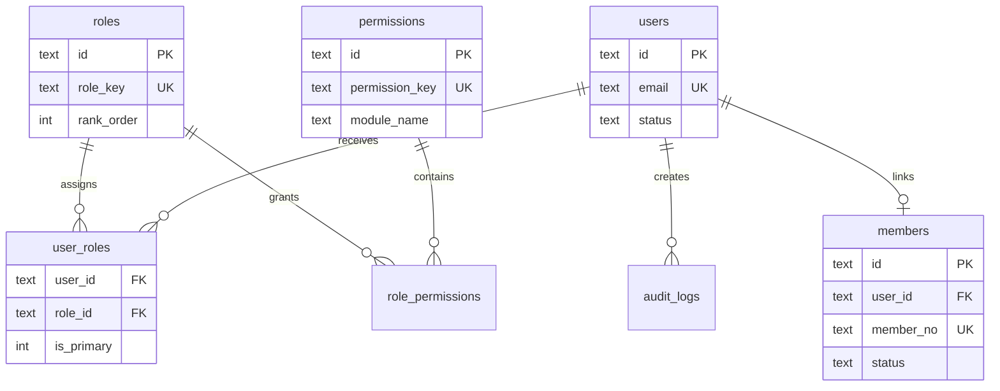
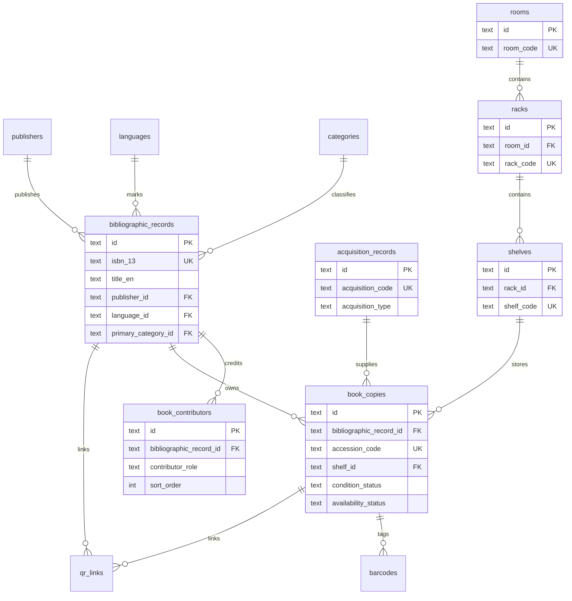
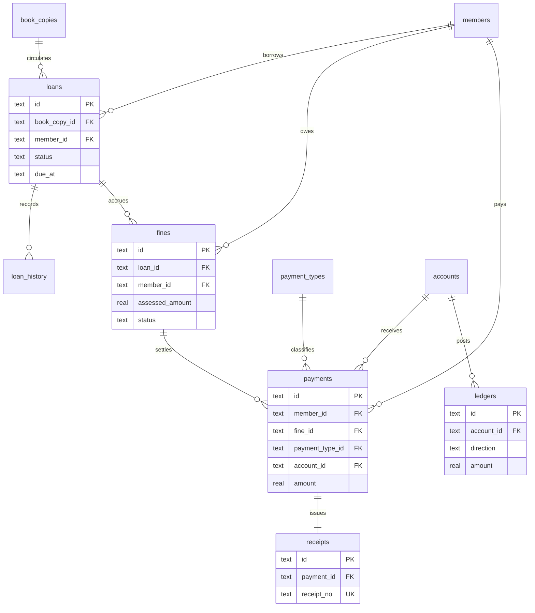
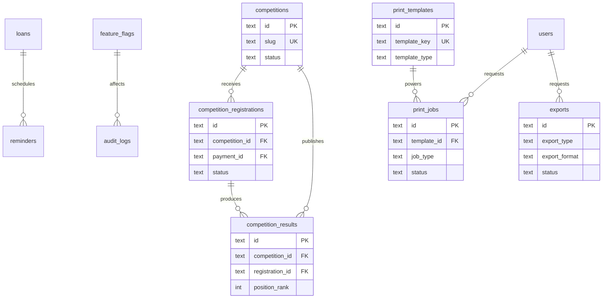

# Data Model and ERD

## Core modeling principles

- Bibliographic records are title-level. A single record may have many physical copies.
- Physical copies are inventory-level. Each copy has its own accession code, condition, barcode, QR, location, and acquisition history.
- Members are library patrons and may optionally link to a `users` record for portal access.
- Financial state is ledger-ready. Payments, receipts, fines, accounts, and ledgers remain separate.
- Generic operational artifacts such as barcodes, QR links, print jobs, and exports are modeled explicitly.

## Security and Identity ERD

## Catalog and Inventory ERD

## Circulation and Accounting ERD

## Programs and Operations ERD

## Table notes

- `book_contributors` intentionally keeps contributor names inline so cataloging stays simple for community libraries; an authority table can be added later without changing the title/copy boundary.
- `barcodes` and `qr_links` are polymorphic so the same print pipeline can serve copies, members, receipts, and competition assets.
- `accounts` supports both control accounts and future member-specific subaccounts through `owner_type` and `owner_id`.
